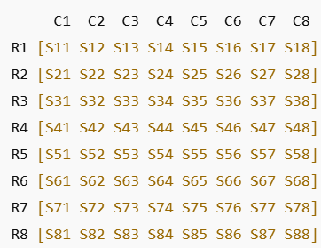
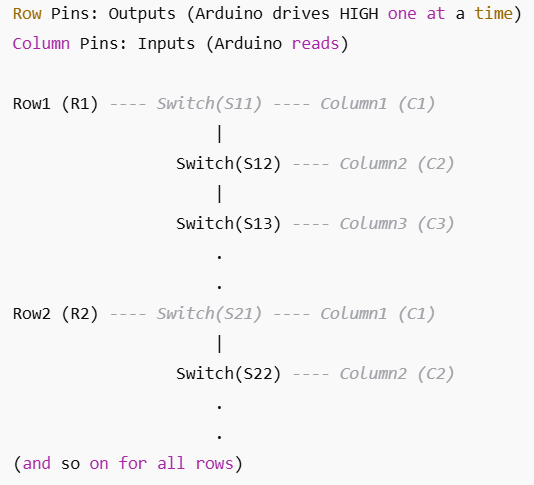

 # Step-by-Step Deep Dive: Chessboard Sensor Matrix Design

Alright! Let’s go **even deeper** — step by step, full electronics + logic explanation, like you’re designing this for production.

---

## Problem Recap:

We have:
- 64 squares (8x8 chessboard)
- Arduino (~20 I/O pins max)
- Each square outputs **1** when a piece is lifted
- We need to **know exactly which square is activated**, using the minimum number of Arduino pins.

No camera, no RFID, no magnetic sensors.

The method: **Matrix Scanning**

---

## Step 1: Understand What a Matrix Scan Is

### Analogy: Like a keyboard matrix

A typical keyboard has over 100 keys but only ~20 pins.  
We’ll **copy this idea** for our chessboard!

### 1A. Chessboard Layout:

<!-- dig1b -->


Each "Sxy" is a square.

Instead of giving every square its own wire:
- Connect squares along **Rows (R1–R8)** — outputs.
- Connect squares along **Columns (C1–C8)** — inputs.

When a piece is lifted, the square **closes a connection** between its row and column.

---

## Step 2: Hardware Wiring in Detail

### Components needed:
- 64 sensors (pressure switches or touch sensors)
- Arduino
- Pull-down resistors
- Wires for matrix connections

### Wiring logic:
- **All sensors in a row** are connected together to a single Arduino output pin.
- **All sensors in a column** are connected together to a single Arduino input pin.

### Simple Circuit Diagram (conceptual):

<!-- dig2b -->


---

## Step 3: How Scanning Works, Electrically

When Arduino drives **Row1 HIGH**, and others LOW:
- No piece lifted → no current flows.
- Piece lifted from S14 (Row1, Column4):
  - Row1 (HIGH) ➔ Switch (Closed) ➔ Column4 (reads HIGH!)

Arduino:
- Checks all columns.
- Sees Column4 is HIGH → knows **S14 (Row1, Column4) is activated**.

Then:
- Set Row1 LOW, Row2 HIGH.
- Scan columns again.

Repeat fast (milliseconds).  
Effectively, you check the whole board 1000+ times per second.

---

## Step 4: Pin Count Calculation

| Component | Count |
|-----------|--------|
| Rows      | 8 pins |
| Columns   | 8 pins |
| **Total** | **16 pins ✅** |

No extra chips needed!

---

## Step 5: Debouncing (Important!)

Switches may "bounce" when closing.

### Solution:
- Add software debounce (~10ms delay).
- Optionally, add capacitors across the switches.

Example debounce logic:

```c
if (digitalRead(cols[c]) == HIGH) {
  delay(10); // debounce delay
  if (digitalRead(cols[c]) == HIGH) {
    // confirmed activation
  }
}
```
# Step 6: Optional Improvements

### If you want even fewer pins:

Use **multiplexers** or **shift registers**:
- **CD74HC4067 (16-channel multiplexer):** 16 signals using 4 pins!
- **74HC165 shift register (parallel-in serial-out):** Read 8+ signals with 3 pins!

With this, you could reduce from 16 pins ➔ just **7 or fewer pins** total!

### Example:
- Multiplex 8 rows (4 control pins)
- Multiplex 8 columns (4 control pins)
- Arduino uses **8 pins total**, saving space!

---

# Step 7: Arduino Code Logic (Deeper)

Here’s how Arduino scans the matrix:

```c
void scanBoard() {
  for (int row = 0; row < 8; row++) {
    // Set all rows LOW
    for (int r = 0; r < 8; r++) {
      digitalWrite(rows[r], LOW);
    }
    // Set current row HIGH
    digitalWrite(rows[row], HIGH);

    // Read columns
    for (int col = 0; col < 8; col++) {
      if (digitalRead(cols[col]) == HIGH) {
        Serial.print("Piece lifted from: Row ");
        Serial.print(row);
        Serial.print(", Column ");
        Serial.println(col);
      }
    }
  }
}
```
# Step 8: Real Chessboard Mapping

Map row/column numbers to real chess notation:

| Row (Arduino) | Chess Rank |
|---------------|------------|
| R1            | Rank 8     |
| R2            | Rank 7     |
| ...           | ...        |
| R8            | Rank 1     |

| Column (Arduino) | Chess File |
|-----------------|------------|
| C1              | File "a"   |
| C2              | File "b"   |
| ...             | ...        |
| C8              | File "h"   |

So:
- Row 1, Column 1 = **a8**
- Row 8, Column 8 = **h1**

You can use this for nice serial output:

```c
char files[] = {'a', 'b', 'c', 'd', 'e', 'f', 'g', 'h'};
int ranks[] = {8, 7, 6, 5, 4, 3, 2, 1};
```
# Step 9: Performance Consideration

- Arduino scans rows and reads columns very fast — thousands of times per second.
- Human move speed: ~1 move every few seconds.
- Arduino is **way faster**, so this setup is perfect!

---
