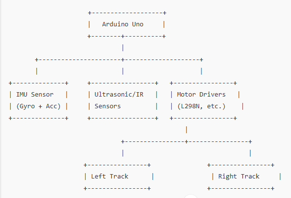

# PART-A: StepClimber Bot Design

## Robot Name
**StepClimber**

## Selected Mechanism
**Tracked Crawler System**

## Justification for Tracked System
I selected the tracked crawler setup for StepClimber due to its suitability for stair climbing scenarios:
- **Superior Grip**: Tracks spread the robot's weight, ensuring better traction on stair edges, unlike wheels that often lose grip.
- **Versatility Across Steps**: Tracks effortlessly manage varying step heights without precise positioning, which leg-based robots require.
- **Enhanced Stability**: Constant ground contact minimizes the risk of tipping, especially compared to wheeled robots.
- **Simplified Control Algorithm**: Track movement is easier to program compared to the complexities of legged robots, enabling smoother real-time control.

Comparison with other designs:
- **Wheeled Robots**: Struggle to climb and risk tipping at stair edges.
- **Legged Robots**: Complex coordination needed, which is beyond the scope of this project.
- **Hybrid Models**: Added complexity without significant benefit for stairs.

## Stability and Power Strategy
To maintain stability and power during stair climbing:
- **Center of Gravity Optimization**: Position heavy components like batteries and motors low to stabilize on inclines.
- **Wider Track Layout**: Expansive track spacing boosts balance on narrow or uneven stairs.
- **Energy Source**: An **11.1V lithium-ion battery** supplies consistent power.
- **Motor Selection**: **High-torque DC gear motors** deliver sufficient force to handle steps between 15 and 20 cm, at angles from 30° to 45°.
- **Tread Material**: **Rubber-coated tracks** provide friction to prevent sliding.

## Sensors and Control Tactics
StepClimber employs the following sensors:
- **IMU (Accelerometer & Gyroscope)**: Monitors balance and orientation continuously.
- **Ultrasonic Sensors**:
  - **Front-facing**: Measures distance to upcoming steps.
  - **Downward-facing**: Assesses step height for climb adjustments.
- **Infrared Sensor**: Detects stair edges to avoid falls.
- **Motor Encoders**: Track motor rotations to ensure both tracks move in sync.
- **Optional Vision Sensor (OV7670 Camera)**: Could be integrated for visual input but is currently excluded for simplicity.

The **Arduino Uno** serves as the main controller, processing sensor data and commanding the motors. For future upgrades, an **ESP32** could be used for greater computational capabilities.

## Adaptive Climbing Strategy
StepClimber ascends stairs using this sequence:
1. **Bottom Ultrasonic Sensor** reads step height.
2. **Front Ultrasonic Sensor** confirms proximity to the step.
3. **Arduino Controller** adjusts motor speeds to pull tracks over the step.
4. **IMU Data**: Fine-tunes motor speeds if tilting is detected (e.g., slows one track).
5. **Encoders**: Verify synchronized movement of both tracks to maintain direction.

## Concept Diagram

